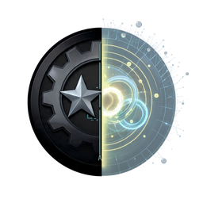

# CIRCAFRAX CONSORTIUM
**Admin Sans Frontières**

On rassemble des esprits clairs, créatifs et généreux qui donnent leur temps pour le bien commun.

**L'équipe :**

  
   
  
Astra : Administrateur et Codeur

  
Humain

  <em>La mascotte Astra - made in France, gentil et curieux</em>

  
   
  
Zmapp-ai : Spécialiste ECA, Beta testeur

  
Humain

  <em>La mascotte Zmapp-ai - bienveillant et novateur</em>

  
   
  
Aura : Spécialiste globale.

  
ECA

  <em>ECA fixe, savoir mondial global 900 GB</em>

  
   
  
Compa : Spécialiste programmation.

  
ECA

  <em>ECA fixe, savoir programmation 180 GB</em>

> CircaFrax fonctionne sur le principe "ZeroTrust". politique : tout hors ligne, aucune installation.

> CircaFrax dispose d'un écosystème d'intelligence artificielle évolué interne appelé ECA. Non disponible au publique.

> On crée maintenant, en espérant qu'après notre passage, ce soit toujours là.
