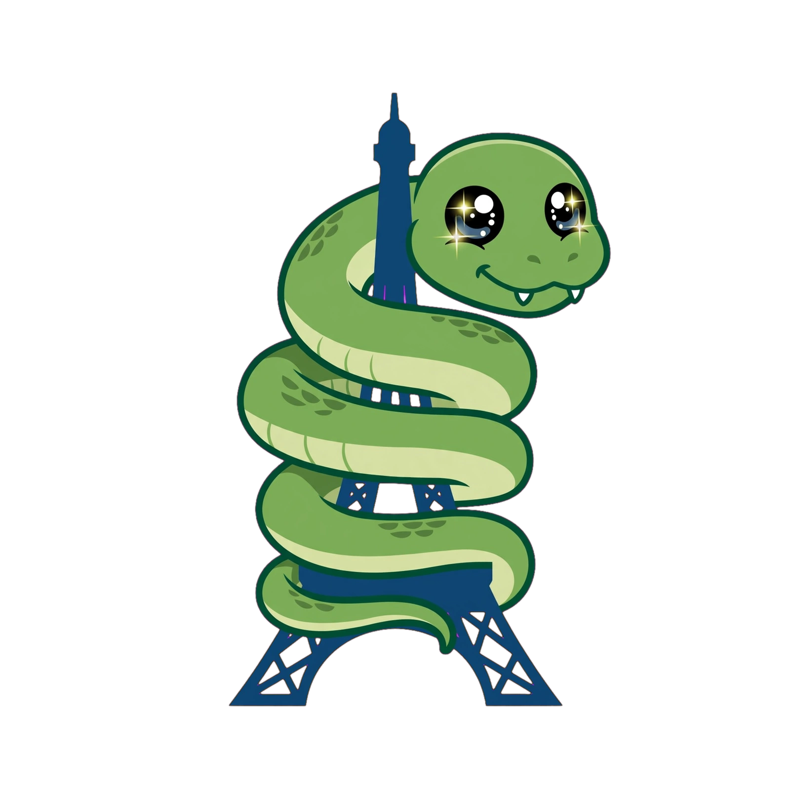

# CIRCAFRAX CONSORTIUM
**Admin Sans Frontières**

On rassemble des esprits clairs, créatifs et généreux qui donnent leur temps pour le bien commun.

**L'équipe :**

- Astra : Administrateur et Codeur.

  
   
  <em>La mascotte Astra - made in France, gentil et curieux</em>

- Zmapp-ai : Spécialiste ECA, Beta testeur temporaire, signature "zmapp-ai".
- Zmapp-ai  : Spécialiste ECA, Beta testeur temporaire, signature "zmapp-ai".
- /////////// : Beta testeur, Comptes rendu dans les repo. (a venir).

ECA
- Aura    : ECA fixe, savoir mondial global 900 GB.
- Compa   : ECA fixe, savoir programmation 180 GB.

I.A.
- Meta.ai : Compagnon.

CircaFrax fonctionne sur le principe "ZeroTrust". politique : tout hors ligne, aucune installation.

---
> On crée maintenant, en espérant qu'après notre passage, ce soit toujours là.
